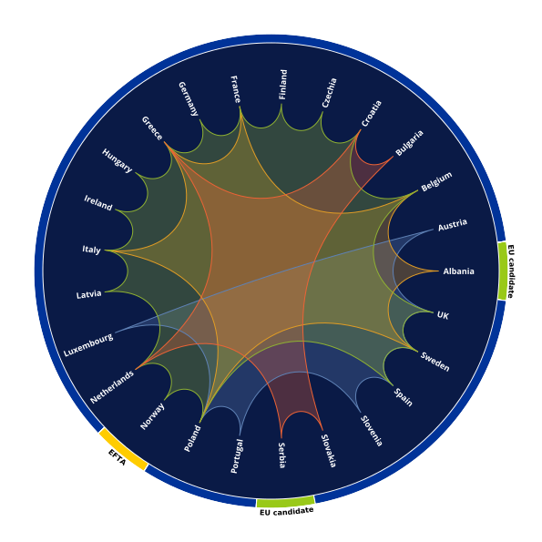

# HyperColl
HyperColl generates visually appealing representations for showing multiple shared connections between a large number of entities in a single graph. The library is in particular useful for visualizing collaborative projects.

The [maunal](manual.pdf) provides all essential information for the user.

The main structure of the representation generated by Hypercoll is very
simple: the entities are ordered in some way around a circle. The circle
bounds a disk, on which we introduce the standard hyperbolic metric.
Each individual connection is drawn as a geodesic, so that each group
that shares connections of the same type corresponds to a hyperbolic
polygon. A few parameters can be used to adjust the visual appearance of
the polygons (shading, shape, etc.).

Here is an example:

In this example, each hyperbolic polygon represents a cooperation
project supported by the [Creative
Europe](https://ec.europa.eu/programmes/creative-europe/) program of the
European Union, which connects certain partner countries.
